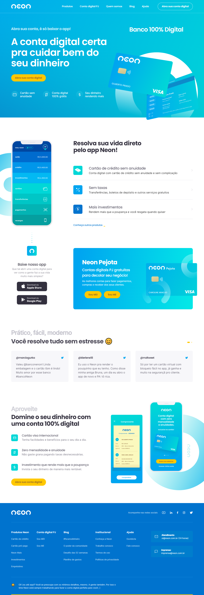

# Redesign Landing Page NEON

Clique no ícone para acessar o site do projeto
 
 

## Descrição

Projeto desenvolvido no curso Codeboost. 
Foram utilizadas duas bibliotecas do JavaScript: AOS Animate e Swiper.

## Tecnologias utilizadas

  

## Layout

